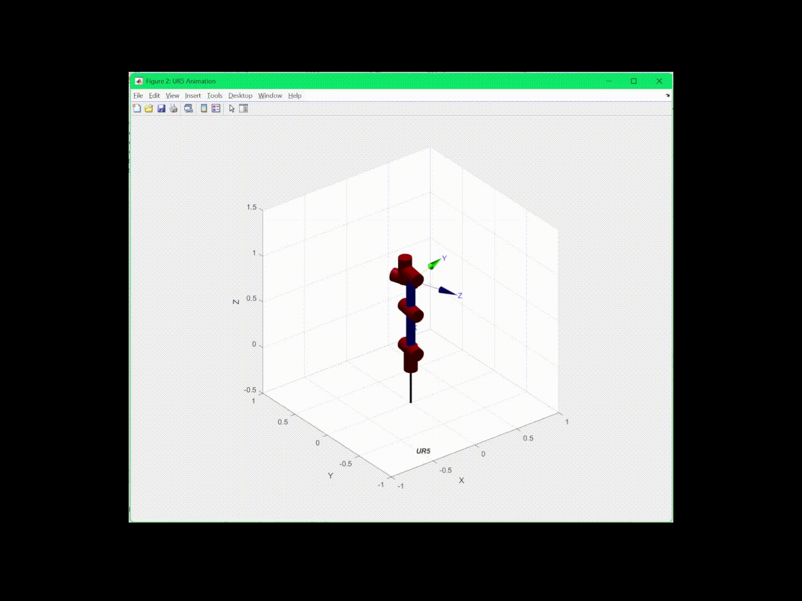

# UR5 Robot Simulation

## Overview

This project simulates the kinematics of a 6-DOF robotic arm inspired by the "Plant Machete" project by David Bowen.  
We model a robot similar to the Universal Robots UR5, with a sword as the end-effector.  
The simulation includes forward kinematics, inverse kinematics, and basic visualization using MATLAB and the Robotics Toolbox.

## Features

- **Forward Kinematics**: Compute joint and end-effector positions from joint angles.
- **Inverse Kinematics**: Compute joint angles from a desired end-effector pose.
- **Visualization**: Display the robot's motion and sword path in MATLAB.

## Installation

- **MATLAB** required.
- **Robotics Toolbox by Peter Corke** must be installed.  
  [Installation Instructions](https://petercorke.com/toolboxes/robotics-toolbox/)

## Usage

1. Clone the repository.
2. Open MATLAB and add the project folder to the path.
3. Run `ur5_project_v2.m` to start the simulation.

## Code Structure

- `forward_kinematics_ur5.m` — Computes forward kinematics.
- `inverse_kinematics_ur5.m` — Computes inverse kinematics.
- `ur5_project_v2.m` — Main script to run simulation.

## References

- [Plant Machete by David Bowen](https://www.dwbowen.com/plant-machete)
- [Robotics Toolbox Documentation](https://petercorke.com/toolboxes/robotics-toolbox/)
- [UR5 DH Parameters](https://www.universal-robots.com/articles/ur/application-installation/dh-parameters-for-calculations-of-kinematics-and-dynamics)

## License

This project is for educational purposes only.
